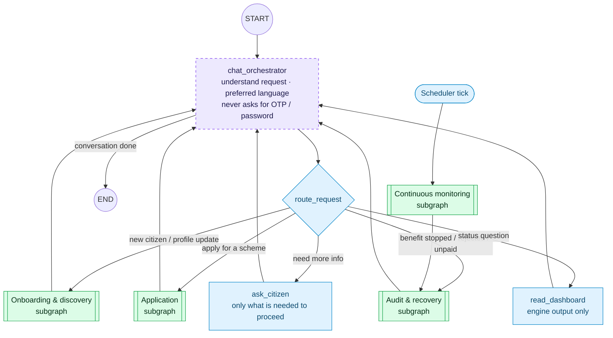

# 1. Top-level orchestrator graph

The citizen talks only to the Chat / Orchestrator node. It gathers what is
missing, then routes into a subgraph. Subgraph results come back to the chat
node, which reports progress truthfully — never claiming success before an
adapter confirms it.

## Graph state

| Field | Type | Written by |
|---|---|---|
| `citizenId` | string | session |
| `locale` | `"en" \| "hi"` | chat_orchestrator |
| `messages` | chat history | chat_orchestrator, ask_citizen |
| `intent` | `onboard \| apply \| recover \| status \| clarify` | route_request |
| `benefitId` | string? | route_request |
| `pendingApproval` | approval id? | subgraphs (on `interrupt()`) |
| `lastResult` | subgraph summary | subgraphs |

Monitoring is not started by the citizen: a scheduler tick enters the audit
subgraph directly, and any resulting approval request surfaces to the citizen
through the chat node.
