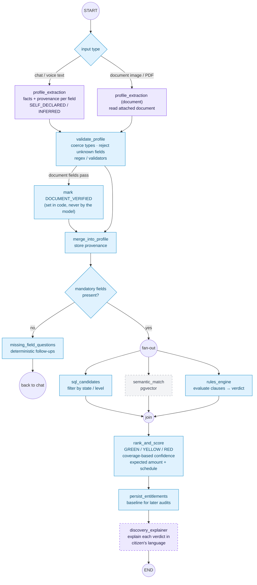

# 2. Onboarding & discovery subgraph

**Agents:** 01 Profile Agent · 02 Entitlement Discovery Agent
**Prompts:** `profile_extraction`, `discovery_explainer`

The rules engine decides eligibility. The explainer only explains verdicts it
is handed; it never changes one.

## Graph state

| Field | Written by |
|---|---|
| `rawInput` / `document` (bytes, never persisted) | entry |
| `extraction` (fields + provenance) | profile_extraction |
| `accepted[]`, `rejected[]` | validate_profile |
| `profile` | merge_into_profile |
| `missingQuestions[]` | missing_field_questions |
| `candidates[]` | sql_candidates, semantic_match |
| `verdicts[]` (scheme, verdict, failed / unknown clauses) | rules_engine |
| `entitlements[]` (verdict, confidence, expected amount) | rank_and_score |
| `explanations[]` | discovery_explainer |

**Fallback:** if `profile_extraction` fails validation after its retries, no
fields are written and the citizen is asked the deterministic questions instead.
If `discovery_explainer` fails, verdicts are shown with their rule-based reasons.
