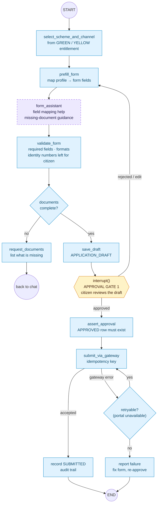

# 3. Application subgraph

**Agent:** 03 Application / Form Agent
**Prompt:** `form_assistant`
**Approval gate 1:** `interrupt()` before any submission

Submission is refused in code unless an `APPROVED` approval row of kind
`APPLICATION_SUBMISSION` exists. The state machine has no edge from
`APPLICATION_DRAFT` straight to `SUBMITTED` — a second, independent guard.

## Graph state

| Field | Written by |
|---|---|
| `schemeCode`, `channel` | select_scheme_and_channel |
| `formFields{}` | prefill_form, form_assistant |
| `missingDocuments[]` | form_assistant, validate_form |
| `validationErrors[]` | validate_form |
| `applicationId` | save_draft |
| `approvalId`, `decision` | approval gate 1 (resume value) |
| `submissionRef`, `idempotencyKey` | submit_via_gateway |

**Bounded authority:** `form_assistant` can suggest field values and explain
documents. It cannot submit, cannot mark a field verified, and its suggestions
pass through `validate_form` like any other input.
