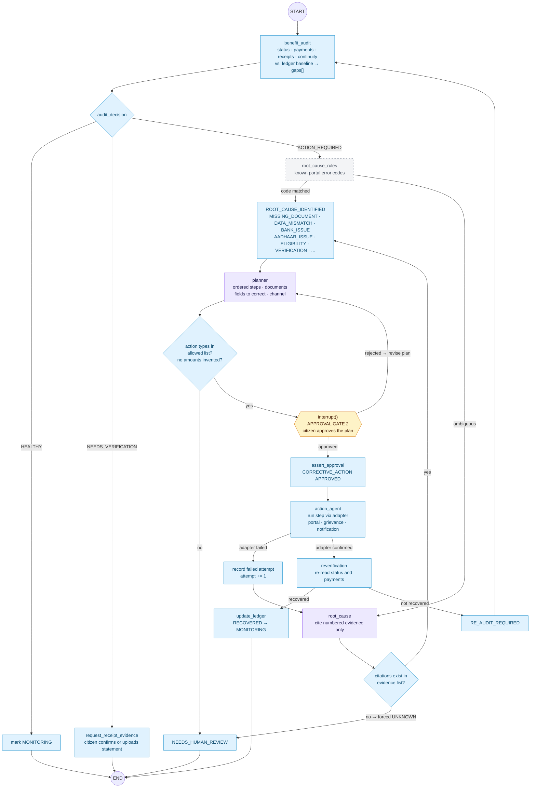

# 4. Audit & recovery loop subgraph

**Agents:** 04 Benefit Audit · 06 Audit Decision · 05 Root Cause Analysis ·
07 Action Planner · 08 Action Agent · 09 Re-verification
**Prompts:** `root_cause`, `planner`
**Approval gate 2:** `interrupt()` before any corrective action runs

This is where the system's agency lives: diagnose → plan → approve → act →
re-verify, and **re-plan after failure** with the previous attempts fed back in
so the same fix is not proposed twice.

## Graph state

| Field | Written by |
|---|---|
| `benefitId` | entry |
| `gaps[]` (kind, expected, actual, evidence) | benefit_audit |
| `decision` (`HEALTHY \| NEEDS_VERIFICATION \| ACTION_REQUIRED`) | audit_decision |
| `evidence[]` (numbered) | benefit_audit |
| `rootCause` (kind, cited evidence, confidence) | root_cause_rules / root_cause |
| `attempt`, `previousAttempts[]` | record failed attempt |
| `actionPlan` (steps of allowed `ActionKind`) | planner |
| `approvalId`, `decision` | approval gate 2 (resume value) |
| `execution` (status, adapter reference) | action_agent |
| `recovered` | reverification |

**Allowed action types** (planner cannot invent others): `REQUEST_DOCUMENT`,
`CORRECT_INFORMATION`, `REQUEST_CLARIFICATION`, `RESUBMIT`, `REAPPLY`,
`SUBMIT_GRIEVANCE`, `ESCALATE_GRIEVANCE`, `RETRY_OPERATION`,
`REQUEST_ASSISTED_VERIFICATION`, `WAIT_AND_MONITOR`.

**Fallbacks:** a model failure in `root_cause` yields `UNKNOWN`, never a guessed
cause; a model failure in `planner` yields no plan and routes to human review.
