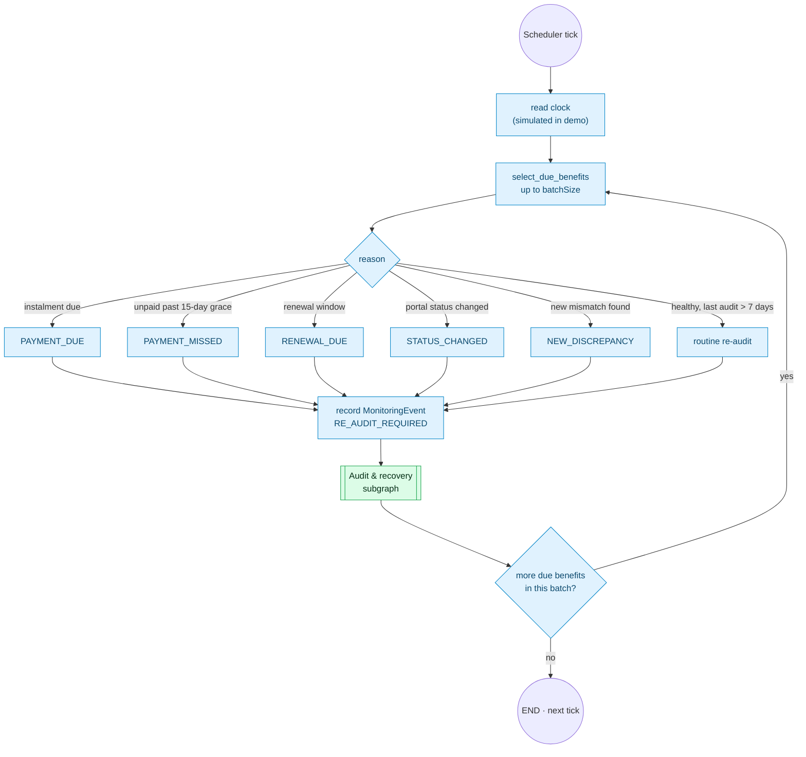

# 5. Continuous monitoring subgraph

**Agent:** 10 Continuous Monitoring — fully deterministic, no prompt.

The monitor only decides *what deserves a look* and records why. The audit
subgraph then works out what actually changed. Each tick is bounded by a batch
size so it finishes inside a serverless time limit; leftovers wait for the next
tick.

## Graph state

| Field | Written by |
|---|---|
| `now` | clock |
| `batch[]` (benefitId, reason) | select_due_benefits |
| `events[]` | record MonitoringEvent |
| `processed`, `remaining` | loop counter |

A minimum gap between routine re-audits of the same benefit stops a benefit
with an open problem from being re-audited on every tick.
