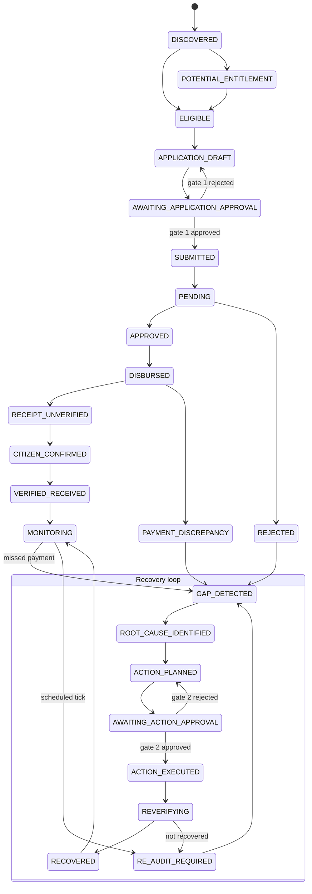

# 6. Benefit lifecycle state machine

Every graph moves a benefit through these states. The source of truth is
`TRANSITIONS` in `lib/engine/stateMachine.ts`; any transition not listed there
throws `Illegal lifecycle transition`.

## Main path (simplified)

Obtain → get paid → verify receipt, with the recovery loop on the right.
Approval gates are the two `AWAITING_*` states.

## Complete transition table (generated from code)

All 68 legal transitions across 23 states.

```mermaid
stateDiagram-v2
  direction LR
  [*] --> DISCOVERED
  DISCOVERED --> POTENTIAL_ENTITLEMENT
  DISCOVERED --> ELIGIBLE
  DISCOVERED --> MONITORING
  POTENTIAL_ENTITLEMENT --> ELIGIBLE
  POTENTIAL_ENTITLEMENT --> APPLICATION_DRAFT
  POTENTIAL_ENTITLEMENT --> MONITORING
  POTENTIAL_ENTITLEMENT --> RE_AUDIT_REQUIRED
  ELIGIBLE --> APPLICATION_DRAFT
  ELIGIBLE --> MONITORING
  ELIGIBLE --> RE_AUDIT_REQUIRED
  APPLICATION_DRAFT --> AWAITING_APPLICATION_APPROVAL
  APPLICATION_DRAFT --> ELIGIBLE
  AWAITING_APPLICATION_APPROVAL --> SUBMITTED
  AWAITING_APPLICATION_APPROVAL --> APPLICATION_DRAFT
  SUBMITTED --> PENDING
  SUBMITTED --> APPROVED
  SUBMITTED --> REJECTED
  SUBMITTED --> GAP_DETECTED
  PENDING --> APPROVED
  PENDING --> REJECTED
  PENDING --> GAP_DETECTED
  PENDING --> RE_AUDIT_REQUIRED
  APPROVED --> DISBURSED
  APPROVED --> GAP_DETECTED
  APPROVED --> MONITORING
  APPROVED --> RE_AUDIT_REQUIRED
  REJECTED --> GAP_DETECTED
  REJECTED --> APPLICATION_DRAFT
  DISBURSED --> RECEIPT_UNVERIFIED
  DISBURSED --> CITIZEN_CONFIRMED
  DISBURSED --> VERIFIED_RECEIVED
  DISBURSED --> PAYMENT_DISCREPANCY
  RECEIPT_UNVERIFIED --> CITIZEN_CONFIRMED
  RECEIPT_UNVERIFIED --> VERIFIED_RECEIVED
  RECEIPT_UNVERIFIED --> PAYMENT_DISCREPANCY
  RECEIPT_UNVERIFIED --> GAP_DETECTED
  RECEIPT_UNVERIFIED --> MONITORING
  CITIZEN_CONFIRMED --> VERIFIED_RECEIVED
  CITIZEN_CONFIRMED --> PAYMENT_DISCREPANCY
  CITIZEN_CONFIRMED --> MONITORING
  CITIZEN_CONFIRMED --> RE_AUDIT_REQUIRED
  VERIFIED_RECEIVED --> MONITORING
  VERIFIED_RECEIVED --> RE_AUDIT_REQUIRED
  PAYMENT_DISCREPANCY --> GAP_DETECTED
  GAP_DETECTED --> ROOT_CAUSE_IDENTIFIED
  GAP_DETECTED --> MONITORING
  ROOT_CAUSE_IDENTIFIED --> ACTION_PLANNED
  ROOT_CAUSE_IDENTIFIED --> MONITORING
  ACTION_PLANNED --> AWAITING_ACTION_APPROVAL
  AWAITING_ACTION_APPROVAL --> ACTION_EXECUTED
  AWAITING_ACTION_APPROVAL --> ACTION_PLANNED
  ACTION_EXECUTED --> REVERIFYING
  REVERIFYING --> RECOVERED
  REVERIFYING --> RE_AUDIT_REQUIRED
  RECOVERED --> MONITORING
  RECOVERED --> RE_AUDIT_REQUIRED
  MONITORING --> RE_AUDIT_REQUIRED
  MONITORING --> GAP_DETECTED
  MONITORING --> DISBURSED
  MONITORING --> APPLICATION_DRAFT
  RE_AUDIT_REQUIRED --> GAP_DETECTED
  RE_AUDIT_REQUIRED --> ROOT_CAUSE_IDENTIFIED
  RE_AUDIT_REQUIRED --> MONITORING
  RE_AUDIT_REQUIRED --> DISBURSED
  RE_AUDIT_REQUIRED --> VERIFIED_RECEIVED
  RE_AUDIT_REQUIRED --> CITIZEN_CONFIRMED
  RE_AUDIT_REQUIRED --> RECEIPT_UNVERIFIED
  RE_AUDIT_REQUIRED --> PAYMENT_DISCREPANCY
```

To regenerate after changing `TRANSITIONS`, extract each `FROM: [TO, ...]`
entry as `FROM --> TO` lines.
