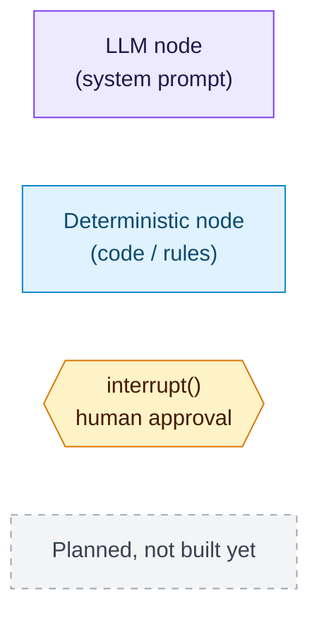
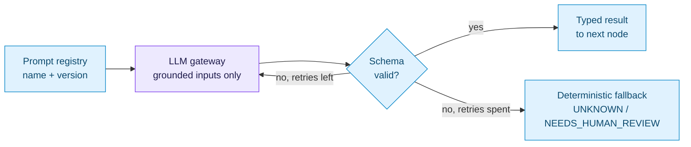

# AdhikarAI — LangGraph state graphs

State graphs for the agent system: one top-level graph and four subgraphs, plus
the benefit lifecycle state machine every graph moves a benefit through.

| # | Graph | What it covers |
|---|---|---|
| 1 | [Top-level orchestrator](01-orchestrator.md) | Chat / Orchestrator node routing into subgraphs |
| 2 | [Onboarding & discovery](02-onboarding-discovery.md) | Profile Agent → Entitlement Discovery Agent |
| 3 | [Application](03-application.md) | Application / Form Agent → approval gate 1 → submission |
| 4 | [Audit & recovery loop](04-audit-recovery.md) | Benefit Audit → Audit Decision → Root Cause → Planner → approval gate 2 → Action → Re-verification |
| 5 | [Continuous monitoring](05-monitoring.md) | Scheduled tick that re-enters the audit loop |
| 6 | [Benefit lifecycle](06-benefit-lifecycle.md) | Every legal state transition, from `lib/engine/stateMachine.ts` |

## Legend

## The numbers

- **10 agents**, **6 system prompts**, **2 approval gates** (`interrupt()`).
- LLM nodes: `profile_extraction`, `discovery_explainer`, `root_cause`, `planner`,
  `form_assistant`, `chat_orchestrator`.
- Deterministic nodes: Benefit Audit, Audit Decision, Action Agent,
  Re-verification, Continuous Monitoring — plus the rules halves of Profile,
  Discovery, Application and Root Cause.

## Every LLM node follows the same inner path

## Built vs. design

The current codebase implements these flows in TypeScript with its own state
machine rather than LangGraph. Nodes drawn dashed (pgvector semantic match,
discovery explainer, form assistant, root-cause known-code rules, chat
orchestrator) are in the design but not yet in the code; everything else exists.

## Rendered images

PNG renders of every graph are in [`images/`](images/) for slides and docs
(GitHub also renders the Mermaid source in each `.md` file directly).

| Graph | Image |
|---|---|
| Top-level orchestrator | [01-orchestrator.png](images/01-orchestrator.png) |
| Onboarding & discovery | [02-onboarding-discovery.png](images/02-onboarding-discovery.png) |
| Application | [03-application.png](images/03-application.png) |
| Audit & recovery loop | [04-audit-recovery.png](images/04-audit-recovery.png) |
| Continuous monitoring | [05-monitoring.png](images/05-monitoring.png) |
| Benefit lifecycle (main path) | [06-benefit-lifecycle-main.png](images/06-benefit-lifecycle-main.png) |
| Benefit lifecycle (all 68 transitions) | [06-benefit-lifecycle-full.png](images/06-benefit-lifecycle-full.png) |

Re-render after editing a diagram with Mermaid CLI:
`npx @mermaid-js/mermaid-cli -i 04-audit-recovery.md -o images/04-audit-recovery.md -e png -s 2 -b white`
(it writes `images/04-audit-recovery-1.png`; rename it over the old image)
