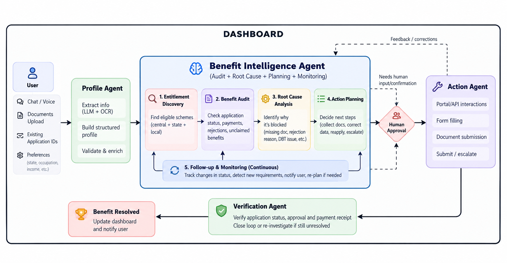

# AdhikarAI

An agentic system that helps citizens actually receive the government benefits they are entitled to, not just discover them.

## The problem

Many people are eligible for government schemes but never receive the benefit. Common reasons:

- Missing or incorrect documents
- Rejected or incomplete applications
- Payment and DBT failures
- Verification delays
- No follow-up after the application is submitted
- Not knowing about other schemes they qualify for
- Fragmented portals and processes across central, state and local governments

Most existing tools help people find schemes and apply. Very few help with what happens after the application is submitted, which is where most benefits get stuck.

## What AdhikarAI does

AdhikarAI follows a benefit through its whole lifecycle:

1. Find the schemes the citizen is eligible for
2. Check the status of existing applications and payments
3. Work out why a benefit is blocked or unclaimed
4. Plan the steps needed to fix it
5. Carry out those steps once the citizen approves them
6. Verify that the benefit was actually received, and re-investigate if it was not

For example, a farmer eligible for five schemes might be receiving one, have a blocked payment on another, a rejected application on a third, a pending verification on a fourth, and never have applied for the fifth. AdhikarAI identifies each of these, finds the cause, and builds a plan to recover them.

## Architecture

The system is a stateful multi-agent workflow. Each agent has one responsibility, and the workflow can loop back when an action fails or a case is still unresolved.

### Inputs

The user provides information through chat or voice, document uploads, existing application IDs, and preferences such as state, occupation and income.

### Profile Agent

- Extracts information from conversations and documents (LLM and OCR)
- Builds a structured citizen profile
- Validates and enriches the profile

### Benefit Intelligence Agent

The core of the system. It runs five stages:

1. Entitlement discovery: find eligible central, state and local schemes
2. Benefit audit: check application status, payments, rejections and unclaimed benefits
3. Root cause analysis: identify why a benefit is blocked, such as a missing document, a rejection reason or a DBT issue
4. Action planning: decide the next steps, such as collecting documents, correcting data, reapplying or escalating
5. Follow-up and monitoring: track status changes, detect new requirements, notify the user and re-plan when needed

### Human approval

Before any consequential action, such as submitting an application, uploading documents or changing personal details, the plan is shown to the user for confirmation. The agent also pauses here when it needs input it cannot get on its own.

### Action Agent

Carries out approved steps:

- Portal and API interactions
- Form filling
- Document submission
- Submission and escalation

Results and errors are fed back to the Benefit Intelligence Agent so it can correct the plan.

### Verification Agent

Checks application status, approval and payment receipt. If the benefit was received, the case is closed and the dashboard is updated. If not, the case goes back for investigation.

## How we measure success

Not by the number of schemes recommended or applications generated, but by outcomes:

- Benefit recovery rate: share of blocked or unclaimed benefits that were recovered
- Application completion rate: share of started applications that were completed
- Resolution time: time taken to resolve a blocked benefit
- Unclaimed benefit value: estimated value of benefits the citizen is eligible for but not receiving
- Successful outcome rate: share of cases where the citizen actually received the benefit

## Responsible use

AdhikarAI handles sensitive personal data, so the design follows a few rules:

- Explicit user consent before collecting data
- Human approval for every consequential or irreversible action
- Minimal data retention and secure document handling
- Explainable eligibility decisions
- Audit logs for every action an agent takes

## Tech stack

To be finalised. Currently planned:

- Agents: Python, LangGraph, LangChain
- Backend: FastAPI, PostgreSQL
- Document processing: OCR and structured extraction
- Automation: Playwright, government APIs where available
- Frontend: Next.js

## Status

Early prototype. Eligibility results and portal interactions should be checked against official government sources before any real-world use.
